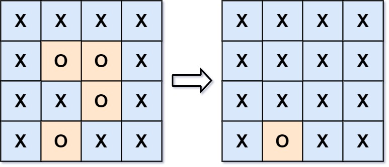

# [mid] #0130 被围绕的区域

给你一个 `m x n` 的矩阵 `board` ，由若干字符 `'X'` 和 `'O'` 组成，**捕获** 所有 **被围绕的区域**：

- 连接：一个单元格与水平或垂直方向上相邻的单元格连接。

- 区域：连接所有 'O' 的单元格来形成一个区域。

- 围绕：如果一个区域中的所有 'O' 单元格都不在棋盘的边缘，则该区域被包围。这样的区域 完全 被 'X' 单元格包围。

通过 **原地** 将输入矩阵中的所有 `'O'` 替换为 `'X'` 来 **捕获被围绕的区域**。你不需要返回任何值。

**示例 1：**

</img>

- 输入 `board = [["X","X","X","X"],["X","O","O","X"],["X","X","O","X"],["X","O","X","X"]]`
- 输出 `[["X","X","X","X"],["X","X","X","X"],["X","X","X","X"],["X","O","X","X"]]`
- 解释 被围绕的区间不会存在于边界上，因此不会存在。

## 思路

该题关键在于如何判断 `O` 区域是否被包围。注意到题目中说：**如果**一个区域中的所有 `'O'` 单元格都不在棋盘的边缘，则该区域被包围。这样的区域 完全 被 `'X'` 单元格包围。因此我们可以先从边界上的 `O` 出发，使用 DFS 或 BFS 将与之相连的 `O` 标记为特殊字符（比如 `#`），表示这些 `O` 不被包围。最后遍历整个棋盘，将剩余的 `O` 替换为 `X`，将 `#` 恢复为 `O`。